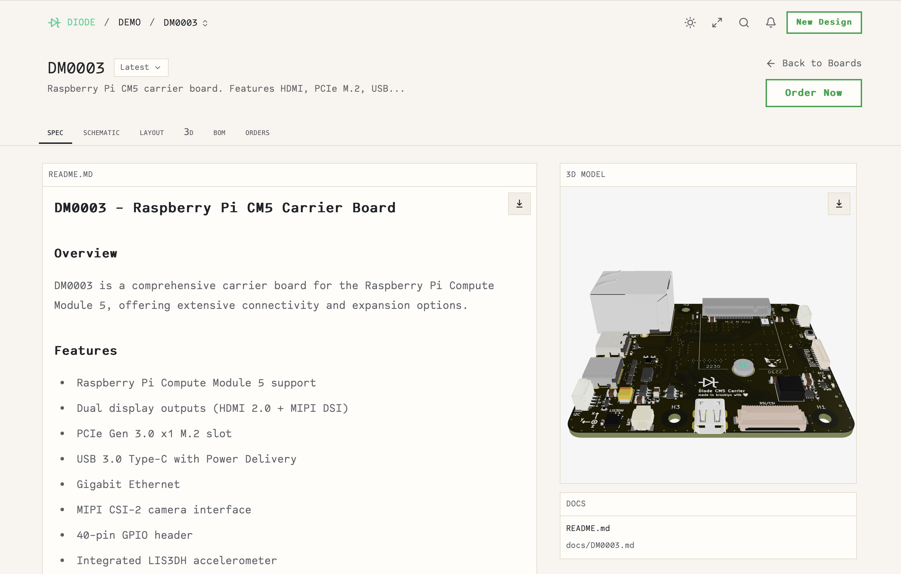

+++
title = 'So you want to AI your PCBs?'
date = 2026-02-22
+++

It's unclear how AI makes its way into the electronics and PCB world. There are a lot of players getting into the space and a lot of skeptical
electrical engineers wait to see how it all plays out. This post is a brief overview of each company on my watch list. I might follow up
with demos of each one later.

There are a few approaches being taken, **design with code 💻**, **chat with design 💬**, and **blackbox 📦**. All have their flaws which is slowing adoption.

| | Company | Website | GitHub | Funding |
|--|---------|---------|--------|---------|
| 💻 | [JITX](#jitx) | [jitx.com](https://www.jitx.com/) | [JITx-Inc](https://github.com/JITx-Inc) | ~$12M Series A (Sequoia) |
| 💻 | [Diode Computers](#diode-computers) | [diode.computer](https://www.diode.computer/) | [diodeinc](https://github.com/diodeinc) | ~$11M Series A (a16z) |
| 💻 | [atopile](#atopile) | [atopile.io](https://atopile.io/) | [atopile](https://github.com/atopile/atopile) | $500K Seed (YC) |
| 💻 | [tscircuit](#tscircuit) | [tscircuit.com](https://tscircuit.com/) | [tscircuit](https://github.com/tscircuit/tscircuit) | undisclosed (Boost VC) |
| 💬 | [Flux](#flux) | [flux.ai](https://www.flux.ai/) | [buildwithflux](https://github.com/buildwithflux) | ~$12M Seed (Outsiders Fund) |
| 📦 | [Quilter](#quilter) | [quilter.ai](https://www.quilter.ai/) | [quilterai](https://github.com/quilterai) | ~$40M Series B (Index) |
| 📦 | [DeepPCB](#deeppcb) | [deeppcb.ai](https://deeppcb.ai/) | | InstaDeep (acquired by BioNTech) |

### Design with code
These involve using code to describe schematics and in some cases board layout as well. This is a solid approach since that is the most time consuming part of
electronics design (est ~40%) and the LLMs are eager to do things with code[^1]. For the most part, you are still routing manually.

#### JITX
Founded by Duncan Haldane in 2017, they started out with their own language built on top of [Stanza](https://lbstanza.org) but recently
pivoted to a full rebuild in native Python. This was my biggest complaint when I first tried it out in 2020 so nice move with the rebuild!
JITX runs as a VSCode extension that connects to your JITX account and has board and schematic viewing tools. They have a free plan for opensource
stuff (not sure of all the limitations) and contact us pricing for enterprise. Their new [routing tools](https://www.youtube.com/watch?v=Ekf5dXSDk6U) look very usable.
I'm excited to give JITX another shot.

#### Diode Computers
Founded by Lenny Khazan and Davide Asnaghi during YC Summer 2024, they began with a schematic and PCB design review system but later pivoted to the design
with code approach. They have their own python-esque language called Zener ([the docs](https://docs.pcb.new/pages/spec) are good)
to describe schematics and export the footprints to KiCAD for you to route manually. I met up with the team at the New Lab in Brooklyn a few months ago and they were super nice!
They're building some great visualization, part finding, and order workflow tooling in a very open way which is nice to see. I tried designing something with Zener and struggled with it a bit but that was before they did [their work with Anthropic](https://claude.com/blog/making-claude-a-better-electrical-engineer) so I do want to give it another go. They make money by charging clients anywhere from $10k-$50k for new designs which is ~10x cheaper than a US consultant would charge. Great business model! 

#### atopile
Founded by former Tesla engineers Matt Wildoer, Timothée Peter, and Narayan Powderly in 2023, they have their own python-esque language called ato which is
used to describe schematics and you do the routing in KiCAD ([for now](https://github.com/atopile/atopile/discussions/881)).
They have a public [package system](https://packages.atopile.io) for symbols, footprints, and pre-routed design blocks. This seems super powerful and if you are using
common design blocks you could already have a lot of your routing done for you. They have a very active Discord community where you can see system level updates
and follow along with community projects. I briefly tried atopile a year ago but didn't get too far with my design and then went back to KiCAD,
will need to give it another shot. It is not immediately clear what their business model is.

#### tscircuit
This started as (seemingly) a passion project of Severin Ibarluzea's in 2022 and became his full-time thing in 2024. It uses React Typescript components to define your
schematic and I think has some kind of routing system but I can't yet tell. You can use it in browser as shown below or run it locally. Going with React is a bold choice
and will be a hurdle to get electrical engineers to use it but if its AI all the way down then maybe it doesn't matter? They were working a lot on an autorouter
about a year ago but I don't see any updates on it lately, curious what happened there. There is a package system built on npm which lets you reuse and share
components and design blocks. Looking forward to digging into how the routing works. It is not immediately clear what their business model is.

### Chat with Design
This is more of a copilot approach where you use a traditional user interface to build your schematic and route but also have a copilot style chat bar for AI stuff. This
makes a lot of sense and builds on the original GitHub copilot model in VSCode.[^2]

#### Flux
Founded in 2019 by Matthias Wagner, Lance Cassidy, and Christian Blank, they started as a fully collaborative in browser electronics design platform and tacked on an AI copilot in 2023.
It seems like they dump a lot of money into influencer ads and you hear about them a lot if you watch hardware videos on YouTube. They have a credit based pricing model
starting at $15/month and you can't even try it out without signing up for a 14 day trial which is a huge barrier to entry.
I am curious to see the full version since I hear about it a lot but have never heard anyone who designs boards talk about it in a meaningful way.

### Blackbox
This approach accepts minimal input form the user and gives you a finished board design.
The ones below are more traditional auto-routers and do not have any schematic features.

#### Quilter
Founded in 2019 by Sergiy Nesterenko, they are a physics driven AI autorouter. You have to do the schematic and footprint generation yourself so it could pair nicely with 
Diode or atopile to give you a full design system. I uploaded a very minimal PCB to try it out. It generates ~100 candidate layouts and emails you when its done.
They recently did a complex layout for an iMX8M SOM and carrier board in ~10x less time than a human. This is super cool! I will try using some of my old designs to see
how it compares to my routing and also try pairing it with a code based solution in the future.

#### DeepPCB
Founded in 2019 by Karim Beguir, they're a side project of [Instadeep](https://instadeep.com/) which was acquired by BioNTech
(yes the COVID vaccine co) in 2023. They have a web based platform where you upload a PCB
file and it will place components as well as auto-route. They have a confusing credit based system
and I don't know how many I would need to run a board. I guess you do get a slight say in where things
go by defining keep out areas. Stacking this head to head with Quilter would be a cool contest later.

### Anyone else?
This space is still fresh and needs new ideas in my opinion.

Are there any platforms or apps you think I should keep my eye on or do a deeper dive on?

Shoot me an email eddie@studlabs.com

[^1]: You might be asking why can't we just feed KiCAD files to the LLM? KiCAD uses a super verbose text format called [s-expressions](https://dev-docs.kicad.org/en/components/sexpr/index.html). The file representing an [ESP32 microcontroller is 700 lines of text](https://gitlab.com/kicad/libraries/kicad-symbols/-/blob/master/MCU_Espressif.kicad_symdir/ESP32-C3.kicad_sym)! It sort of works sometimes but usually you hit a lot of snags trying to get the LLM to do things with KiCAD.

[^2]: I originally had [Circuit Mind](https://circuitmind.io) and [Celus](https://celus.io) here but removed them since I couldn't find a way to try it out without contacting them
