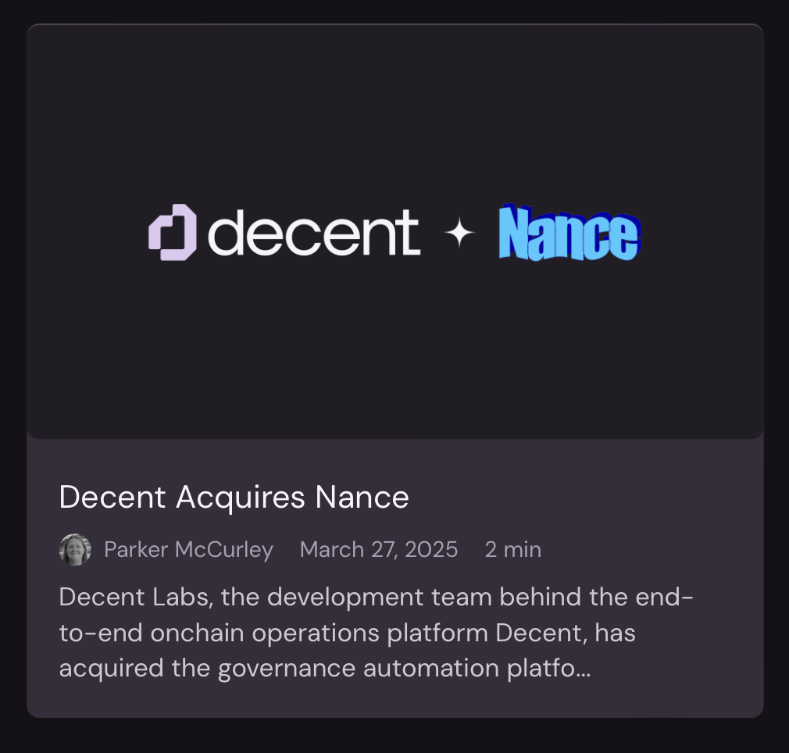
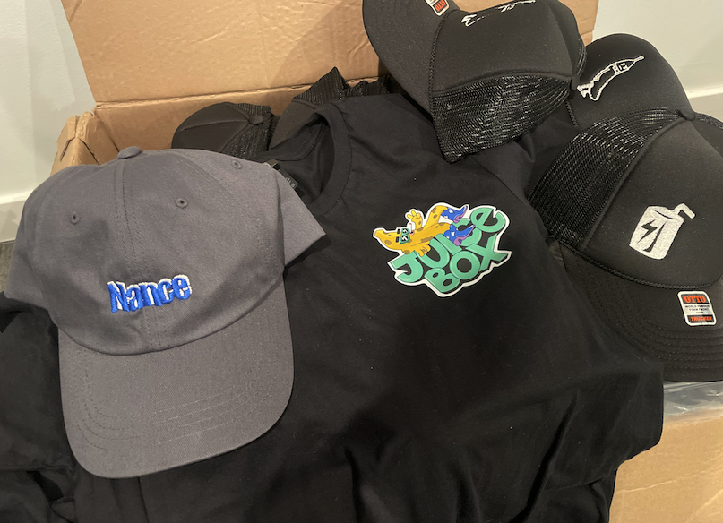

+++
title = 'The Nance Story'
date = 2025-11-12
+++

### Backstory
In 2021 my sister and brother-in-law launched an NFT project called Fly Frogs[^1]. He did the [art](https://opensea.io/item/ethereum/0xef11a9bcd83c7a7d0cc7a37878964bb5300da6d5/1), she wrote the [code](https://etherscan.io/token/0x31d4da52c12542ac3d6aadba5ed26a3a563a86dc#code).
I was working at an engineering consultancy called [Very](https://www.verytechnology.com) at the time doing electrical engineering and product development for clients that either had an idea they wanted to turn into a product OR
to rescue them from their previous consultancy that promised they could do the same. It was a good place to work but consultancies are a tough business, maintaining a satisfied engineering work force is difficult especially with the
constant reminder of what the company is charging clients vs. what they are passing on to the employees!

I had minimal software skills, I would write Python scripts to manage hardware development stuff or flash firmware on devices but was always told I just didn't have the chops to be a real software developer.
As the Fly Frog community Discord chat continued to grow I dove into learning Javascript through the [Discord bots API](https://discord.com/developers/docs/intro).

Late summer 2021 there was a [@nnnnicholas](https://x.com/nnnnicholas) tweet asking for someone to build a bot that counts the number of times a user in a Discord server says [gm](https://typefully.com/blog/what-does-gm-mean). From there I
got in touch with [Zeugh](https://x.com/theZeugh), the head of a group called [CanuDAO](https://canudao.xyz) that was managing the community for *another* DAO called Juicebox (more on them in a bit). The gm bot was [my first software](https://github.com/jigglyjams/gm) with real users. It didn't do a whole lot (responds with an emoji for the number of gm's a user has said in a row 🤷‍♂️) but it was being used! It's still used today and there is even a dashboard with stats [here](https://gm-jigglyjams.vercel.app/dashboard). Writing bots felt powerful, working with strangers from around the world was fun, and I finally was getting paid to write software.

### A Spark

In November 2021 a rag tag group of 30 formed [ConstitutionDAO](https://www.constitutiondao.com) with one goal: buy one of the thirteen remaining copies of the Constitution of the United States of America. The main contributor to the Juicebox protocol (and all around great dude) [jango](https://jango.eth.sucks) hopped into their Discord and told them how the collection of smart contracts and web app called [Juicebox](https://docs.juicebox.money) works. They raised 11.6k ETH through the platform. That was not enough to beat Ken Griffith[^2] and his $43.2M bid at the Sotheby's auction, but people saw the power of crypto[^3]. Juicebox gained some traction and now had more funds to continue development. With more funds in a DAO comes more governance, the process by which members and outsiders propose what they want to do and how much they want to get paid.

At the time Juicebox was using [Notion](https://www.notion.com) to store proposals, [Discord](https://discord.com) to discuss and do an initial poll, [Snapshot](https://snapshot.box/#/about) to do a formal token weighted vote, and [Safe multisig](https://safe.global) to review and execute.
This was a very manual process that was run by early Juicebox contributors [0xSTVG](https://x.com/0xSTVG) and [filipv](https://filip.world). I saw a path to automation and built the [first version of Nance](https://github.com/jigglyjams/nance).
It was a basic script but it saved core contributors a significant amount of time and Juicebox saw real value in it. The development continued over nights and weekends since I was still
working as an electrical engineer at Very.

### Remove dependencies
In July 2022 Nance was butting up against some of the limitations of Notion and began to feel the need for our own frontend app. Another young software dev named [twodam](https://x.com/twodam_eth) was building a Juicebox ecosystem project called [juicetool](https://github.com/jbx-protocol/juicetool). We combined forces and Nance was a real team now, we even had a [GitHub organization](https://github.com/nance-eth)! Nicholas was our product manager.

Running governance automation for Juicebox was the perfect software development cycle. Every few days there were tasks that the app would have to complete and in between those times we could iterate to make it better. Nance began using [dolt](https://www.dolthub.com) (mySQL + git-like version control) and integrated a markdown editor into the interface thus allowing for complete removal of Notion from the governance process. DAO members could now view and create proposals in our app. It was clunky at first and I remember losing some data once which felt bad, but as we got our weekly feedback from DAO members we slowly improved.

### Development continues
We began to look for other DAOs that might be able to use Nance so that Juicebox wouldn't be the only entity supporting us. Nicholas left at some point and Zeugh joined as PM and sales. He promoted Nance a lot and even gave some talks at conferences about it but making it work for other organizations was hard. Some of that could have been mitigated with a real test suite which I didn't begin to write until much later, but in general its hard to be modular!

I also began to sense how a product can drift towards a consultancy. When you're bootstrapped and customers ask to integrate with their particular set of tools you can quickly make promises to close the deal, only later to realizing that its going to take you weeks to get it working and the monthly fee you quoted them with just isn't worth it. This is tough to avoid if you do not draw hard boundaries between product and consultancy. With such a niche product its a delicate balance.

At the end of 2022 I quit my job at Very and became self employed 😎[^4]. There was no real plan for Nance. Just code, vibes, and a lot of people saying [wagmi](https://en.wiktionary.org/wiki/WAGMI).

### Staying afloat
In early 2023, we began to take things more seriously. We launched our own Discord server, we began conducting our weekly(ish) meeting dubbed Nancehall, we made a GitHub project board. I didn't know how to hire a designer so I made a simple logo and used wordart.

We chugged along for most of the year, continuing to improve the codebase and product but it started to feel too niche to be a success. Not to mention the [big crypto scams](https://en.wikipedia.org/wiki/Bankruptcy_of_FTX), the [small crypto scams](https://www.forbes.com/sites/iainmartin/2023/03/03/ryan-breslow-bolt-convicted-fraudster-movement-dao-lawsuit/) and [everything in between](https://www.web3isgoinggreat.com) that kept me
questioning contributing to this space at all. We carried on, we made [documentation](https://docs.nance.app).

It wasn't until the very end of 2023 we got a cold reach out from a group called DAOSquare, an investment DAO that found us through the Juicebox documentation. twodam and I worked to add support for [gnosis chain](https://www.gnosischain.com) and we had another customer[^5]. It was a nice way to end a wild year.

### Muddling through
The Nance app began to feel sluggish and people were complaining. twodam and I were convinced that we had to rewrite the app in a new framework called Remix to
make it run as speedy as possible.
We thought it'd be simple, but after four months of intense work by twodam it still wasn’t complete. It was definitely prettier, but loading proposals was still slow!
I tried fetching proposal data from the client side instead of through a Next.js API route. This made it blazingly fast, and in hindsight it makes total sense since using an API route requires Vercel to spin up a serverless function. This was slow and a silly mistake.

**A fast app feels good**. Especially for your old users who have been using the crappy slow version for so long. We scrapped the rewrite, and I’m not convinced a rewrite is ever worth it.

Next, I made a hat. **Its all about the merch in the end.**

I started looking for new avenues to push Nance. A former colleague of mine was Head of Community at a company called [Aleo](https://aleo.org). I built them a white-label, self-hosted version of Nance.
It was a jaunt back into consulting but it felt necessary to keep the main product going. The code is disappointingly not opensource
(I need to remember to always push for that early) but the site is still live [here](https://vote.aleo.org). It uses the same markdown editor as Nance, relies on Discord for authentication,
[Supabase](https://supabase.com) for proposal & vote storage, and Aleo compatible wallets for signing of votes[^6]. I got to write the frontend and backend myself and figure out the finer
details of building something you can actually walk away from.

### Another client
In mid 2024 we landed a client that was on our radar for a long time, [MoonDAO](https://www.moondao.com). They launched their own juicebox project in 2022 and raised ~$8M with a mission to help democratize human space travel.
They've sent two people to space on Blue Origin rockets including [Dr. Eiman Jahangir](https://en.wikipedia.org/wiki/Eiman_Jahangir) and [YouTuber Dude Perfect](https://www.youtube.com/watch?v=YXXlSG-du7c)[^7].
Pablo from MoonDAO is (rightfully) adamant about having everything integrated into the MoonDAO app. They also use Next.js so twodam was able to copy-paste components from our app into theirs. The integration is still [used today](https://www.moondao.com/vote).

The search for more customers lead me to [Shutter](https://www.shutter.network), a group that develops methods of encrypted voting and trading onchain. Shutter DAO had a different governance process, using a
[Discourse forum](https://discourse.org) to discuss proposals instead of Discord. A lot of older and larger DAOs did as well since its a free and opensource platform you can host yourself on a modest server.
I made a [proposal in their forum](https://shutternetwork.discourse.group/t/rfc-nance-governance-automation/520)
and got some initial feedback but then the momentum petered out. They were already using another governance platform called [Decent](https://decent.build). My proposal got the attention of Decent's founder and crypto OG
[Parker McCurley](https://x.com/moondog_eth), he wanted to chat. Zeugh, knower of all people, setup the group chat.

### Acquisition
This is end of 2024. I filmed a detailed demo and sent Parker a message with all the details about Nance. He said we had a lot of features that Decent needs and the CTO would evaluate our codebase to see if there was a possibility of
them acquiring us! He went radio silent for a bit after that and I was convince it wasn't going to happen. I was also convinced that the governance space is *way* too niche and was going to keep maintaining Nance as an opensource app
but was no longer going spend time pitching new customers or features. It sort of felt like [giving up](https://world.hey.com/dhh/when-to-give-up-1dd951f9), but seemed like the right thing to do.

The New Year rolls around and the conversation with Decent picks back up. After some back and forth, we agree to a deal and I fly out to meet the team at ETH Denver! This is a wild experience: I meet the whole team, I'm working their
conference booth and even getting some connections for new clients. The conference is a huge success for Decent (merch game was on point) and it gave me confidence that the acquisition was going to be a good thing for everyone.

I get home and twodam and I get added to Slack. We hit the ground running and get to work.

### Integration

The deal was to integrate Nance into Decent over the next six months and then evaluate joining the team long term. The team at Decent was great, I got to work with their CTO
[John Huang](https://www.linkedin.com/in/john-huang-7338a42), a long time software developer who really pushed twodam and I to make tightly scoped PRs that are required when working with (slightly) larger teams. We we're not
doing this at all when it was just the two of us! Decent had no backend. This made the app a little sluggish at times and integrating Nance was going to speed things up and allow for new features like comments and draft proposals.
I selected [Ponder](https://ponder.sh) to do the offcahin indexing. Its easy to use, lets you control the infrastructure and is natively crosschain. Would recommend.

### Now
Its been a month since I finished the Nance integration and I wrote this tale in order to reflect on the journey.
Nance is an overly optimized tool for a niche problem, this made it a tough business. I am grateful that now I have software chops and got to meet some great people along the way. Also for the merch.

[^1]: they turned them into a 3D printed toy you can buy [here](https://flyfrogs.xyz/collections/all)!
[^2]: yes the one famous for his involvement with GameStop in January of 2021, read more [here](https://www.nasdaq.com/articles/ken-griffin-bet-against-gamestop-bought-a-us-constitution:-are-the-miami-dolphins-next)
[^3]: read more of the tale from founding member and nice guy [Jonah Erlich's](https://x.com/Jierlich) perspective [here](https://www.theverge.com/22820563/constitution-meme-47-million-crypto-crowdfunding-blockchain-ethereum-constitution)
[^4]: for full disclosure, I took one hardware client with me and continued to do electrical engineering for them, this was crucial in allowing me to continue the development of Nance, I am grateful for this
[^5]: technically they didn't pay us until March 2024 but hey I was learning how to sell
[^6]: integrating the Aleo SDK to confirm signatures was a huge pain in the ass and I *think* my app I made is the only one to do so offchain
[^7]: check out more about them [here](https://www.space.com/blue-origin-eiman-jahangir-suborbital-flight-moondao)
